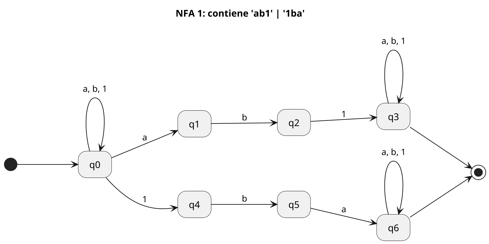
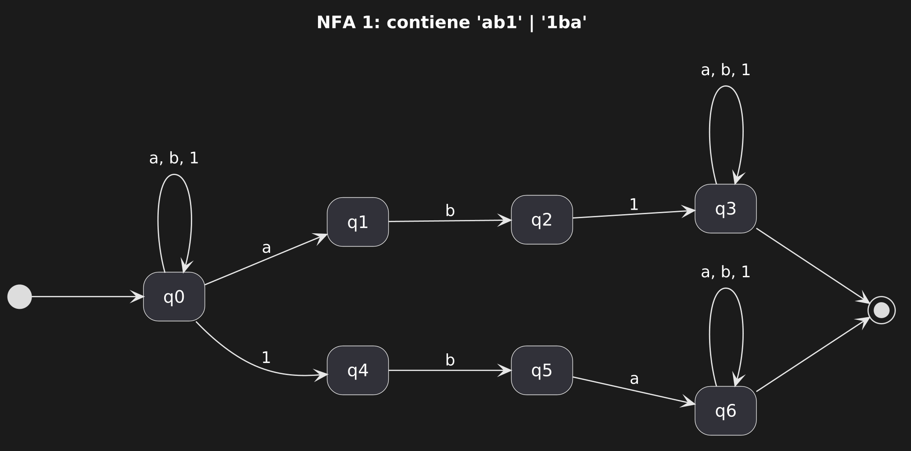
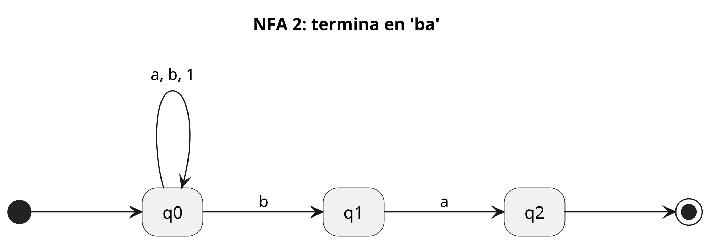
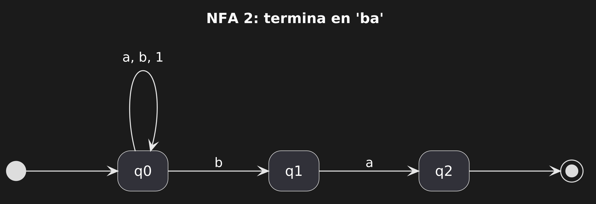
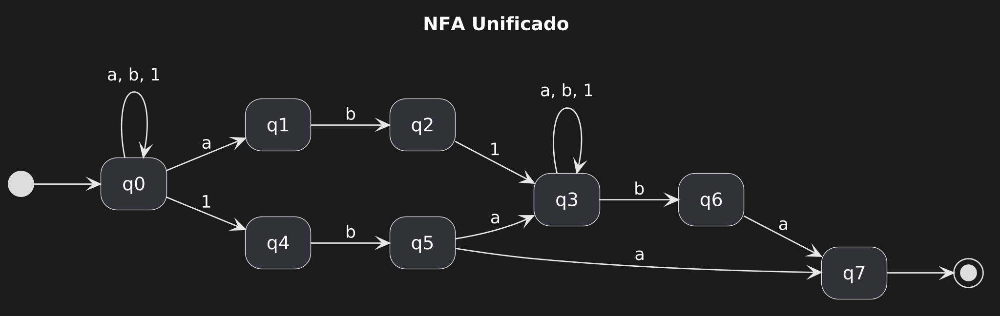
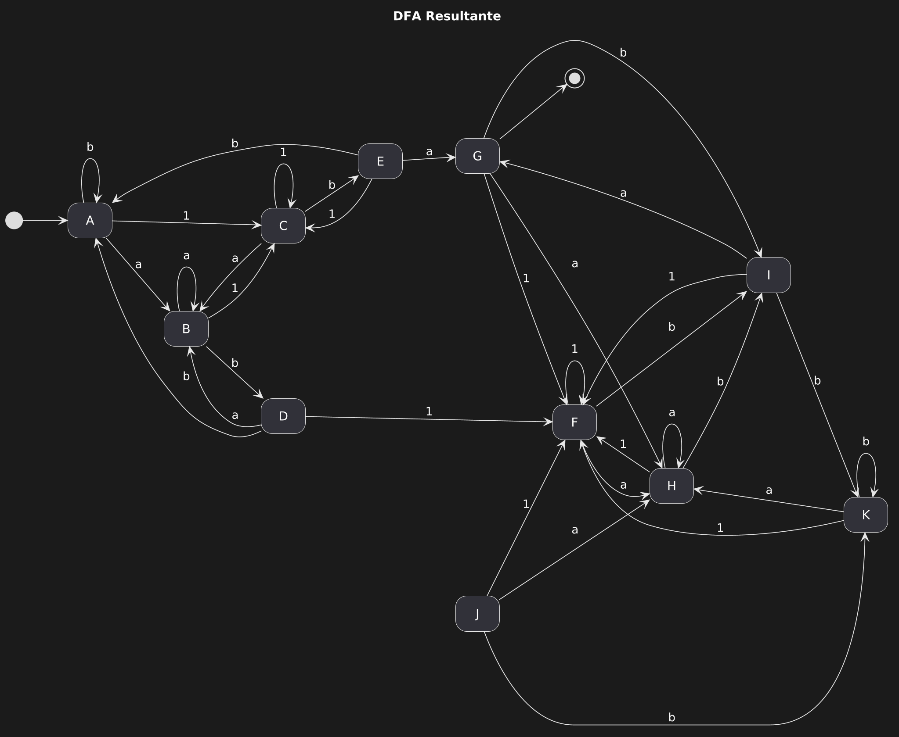

# Evidencia Implementación de Análisis Léxico (Autómata y Expresión Regular)

| Alfabeto | Reglas |
|-|-|
| ab1 | al menos una ocurrencia de 'ab1' or '1ba' |
|  | terminación 'ba' |

<sub>Fig. El lenguaje y el conjunto de reglas que lo conforman</sub>

## Descripción del lenguaje

Se tiene un lenguaje con alfabeto:  
∑ \= {a, b, 1}

Y un conjunto de reglas, tal que cualquier combinación válida siempre termine con ‘*ba*’ y contenga al menos una ocurrencia de ‘*ab1*’ o ‘*1ba*’.

## Modelado del lenguaje
Previo a conseguir un _DFA_, se modeló un _NFA_ por la facilidad que confiere al momento de plasmar estados y transiciones entre esto, "the flexibility of nondeterminism often facilitates the design of language acceptors." (Sudkamp, 2006, p.159)

Esto implicó, en la primera versión de NFA, crear dos autómatas (uno para la ocurrencia de 'ab1'|'1ba' y otro para la terminación 'ba') mismos que terminaron uniéndose en uno solo.

<details><summary>NFA 1: contiene 'ab1' | '1ba'</summary>



</details>




<details><summary>NFA 2: termina en 'ba'</summary>



</details>




A continuación un _NFA_ que corresponde a todas reglas del lenguaje.

<details>
  <summary>Desplegar código de PlantUML</summary>

```PlantUML
@startuml
hide empty description

scale 2048 width

left to right direction
skinparam nodesep 50
skinparam ranksep 50

title NFA Unificado

[*] --> q0

' buscar subcadena obligatoria ---
q0 --> q0 : a, b, 1

' Rama ab1
q0 --> q1 : a
q1 --> q2 : b
q2 --> q3 : 1

' Rama 1ba
q0 --> q4 : 1
q4 --> q5 : b
q5 --> q3 : a
q5 --> q7 : a

' leer cualquier cosa ---
q3 --> q3 : a, b, 1

' hacia el 'ba' final.
q3 --> q6 : b
q6 --> q7 : a

' q7, estado final.
q7 --> [*]
@enduml
```

</details>



<sub>Fig. NFA que representa al menos una ocurrencia de ‘ab1’ o ‘1ba’ y terminación de ‘ba’ de una cadena</sub>

Con el _NFA_ terminado, procedió derivar las transiciones y nuevos estados que constituyen al DFA equivalente.

Para ello se utilizó la técnica de _construcción por subconjuntos_, que a partir de la función de transición (aquella que determina el cambio de estado de la máquina a partir del estado y del símbolo actuales), mapea el conjunto de estados $Q$ y el alfabeto $∑$ hacia un único estado siguiente. Esto es necesario porque la función del NFA mapea a un estado y un símbolo a un conjunto de estados posibles (lo que hace al autómta no determinista).

Bajo este método, se interpreta como un nuevo estado en el DFA a cada conjunto de conexiones suscitadas entre los estados del NFA a través de los símbolos del alfabeto. Esto abarca todas las posibilidades de interconexión y garantizar que se cumplan ambas reglas de manera determinista (Sudkamp, 2006, p.171)

En la práctica, esto implicó identificar al estado inicial (el primero del NFA), seguido de esto, plasmar la relación del NFA en su tabla de transiciones, obtener un producto de sus estados sobre los distintos caracteres del alfabeto, y finalmente deliberar cuáles serían los estados de aceptación (se definió como estado de aceptación a todo estado que incluyera al estado final del NFA).

Con la definición de todo estado de aceptación, se mantiene la propiedad finita.

|Estado|a|b|1|
|-|-|-|-|
|q0|q0,q1|q0|q0,q4|
|q1||q2||
|q2|||q3|
|q3|q3|q3, q6|q3|
|q4||q5||
|q5|q3, q7|||
|q6|q7|||
|q7||||

<sub>Fig. Tabla de transiciones del NFA, representando a la función transición </sub>

| Conjuntos|Estados|a|b|1 |
|-|-|-|-|-|
| q0|A|q0,q1|q0|q0,q4 |
| q0,q1|B|q0,q1|q0,q2|q0,q4 |
| q0,q4|C|q0,q1|q0,q5|q0,q4 |
| q0,q2|D|q0,q1|q0|q0,q4,q3 |
| q0,q5|E|q0,q1,q3,q7|q0|q0,q4 |
| q0,q4,q3|F|q0,q1,q3 |q0,q5,q3,q6|q0,q4,q3 |
| q0,q1,q3,q7|G|q0,q1,q3|q0,q2,q3,q6|q0,q4,q3 |
| q0,q1,q3 |H|q0,q1,q3|q0,q2,q3,q6|q0,q4,q3 |
| q0,q5,q3,q6|I|q0,q1,q3,q7|q0,q3,q6|q0,q4,q3 |
| q0,q2,q3,q6|J|q0,q1,q3|q0,q3,q6|q0,q4,q3 |
| q0,q3,q6|K|q0,q1,q3|q0,q3,q6|q0,q4,q3 |

<sub>Fig. Tabla de transiciones del DFA</sub>

| Estados|a|b|1 |
|-|-|-|-|
| A|B|A|C |
| B|B|D|C |
| C|B|E|C |
| D|B|A|F |
| E|G|A|C |
| F|H|I|F |
| G|H|I|F |
| H|H|I|F |
| I|G|K|F |
| J|H|K|F |
| K|H|K|F |

<sub>Fig. Tabla de adyacencia del DFA</sub>

A continuación, el diagrama del DFA que corresponde con las reglas del lenguaje y el NFA unificado.

<details>
  <summary>Desplegar código de PlantUML</summary>

```PlantUML
@startuml
hide empty description

scale 2048 width

left to right direction
skinparam nodesep 50
skinparam ranksep 50

title DFA Resultante

[*] --> A

A --> B : a
B --> B : a
C --> B : a
D --> B : a
E --> G : a
F --> H : a
G --> H : a
H --> H : a
I --> G : a
J --> H : a
K --> H : a

A --> A : b
B --> D : b
C --> E : b
D --> A : b
E --> A : b
F --> I : b
G --> I : b
H --> I : b
I --> K : b
J --> K : b
K --> K : b

A --> C : 1
B --> C : 1
C --> C : 1
D --> F : 1
E --> C : 1
F --> F : 1
G --> F : 1
H --> F : 1
I --> F : 1
J --> F : 1
K --> F : 1

G --> [*]

<style>
stateDiagram {
  arrow {
    LineThickness 0.85
  }
}
</style>
@enduml
```

</details>


<sub>Diagrama del DFA.</sub>

## Implementación de un autómata DFA

Consideraciones:
- Descargar este repositorio
- Instalar SWI-Prolog*
- Abrir directorio del repositorio
- Ejecutar el script: `prolog pruebas.pl`.

\* La implementación y prueba del DFA se realizó en un ordenador con Debian 13 y SWI-Prolog (version 9.2.9)

Cuando esté ejecutándose, introducir `hacer_pruebas.`.

Se implementó un autómata finito determinista en Prolog que plasma como predicados a cada una de las transiciones del DFA conseguido anteriormente, y como átomos a las cadenas cuya pertenencia al lenguaje se evaluará. 

El código utiliza recursión de cola en el predicado recorrer. Esto se debe a que la llamada recursiva es la última instrucción que se ejecuta en la regla.

Las listas juegan el rol de la cinta de entrada del autómata y la estructura de control del flujo. Al utilizar el operador de descomposición [Simbolo|Resto], la lista actúa como una cola secuencial que permite recorrer el símbolo actual de la cabeza para realizar la transición de estado, mientras el resto de la cadena se delega a la siguiente iteración recursiva hasta llegar a la lista vacía [], que representa la condición de parada del recorrido especificada en el caso base.

### Resultados de implementación

<details><summary>Desplegar</summary>

```text

?- consult('pruebas.pl').
true.

?- hacer_pruebas.
CADENAS VÁLIDAS
Se cumple el resultado esperado:aaab1ba
Se cumple el resultado esperado:aaa1ba
Se cumple el resultado esperado:1ba
Se cumple el resultado esperado:ab11ba
Se cumple el resultado esperado:1baab1ba

CADENAS INVÁLIDAS
Se cumple el resultado esperado:aaabba
Se cumple el resultado esperado:aaa1b
Se cumple el resultado esperado:1baaaaa
Se cumple el resultado esperado:abba
Se cumple el resultado esperado:1abb1ba
true.
```

</details>

## Implementación de una expresión regular equivalente

Consideraciones:
- Descargar este repositorio
- Instalar Python*
- Abrir directorio del repositorio
- Ejecutar el script: `python tests.py` (en Debian, `python3 tests.py`)

\* La implementación y prueba se realizó en un ordenador con Debian 13 y Python 3.13.5

Dentro del script `tests.py` se implementa, utilizando la librería nativa `re`, un patrón regex equivalente al DFA. Las cadenas que se espera que acepte y rechace están contenidas en un arreglo.

Este fue el patŕon utilizado: `^(?=.*(ab1|1ba))[ab1]*ba$`. 

La expresión estuvo pensada para evaluar la línea completa (por ello los anchors de '^' y '$' para inicio y final de línea, respectivamente).

Después, el grupo de comprobación de positive-lookahead contempla la presencia de 0 o más caracteres previo al grupo de captura, que impone la restricción de lenguaje de una mínima ocurrencia de 'ab1' o '1ba'. Los caracteres previos y posteriores al grupo de captura sólo pueden ser constituidas por caracteres que pertenezcan al alfabeto del lenguaje (denotado como [ab1*]) y hacer esto una cantidad de entre ninguna y varias veces (*).(«Re — Regular Expression Operations», s. f.-b)

Por último, para satisfacer el sufijo 'ba' requerido para toda cadena válida correspondiente al lenguaje, se denota 'ba' al final de la expresión.

### Resultados de implementación

A continuación el resultado de la ejecución del código:

<details><summary>Desplegar</summary>

```text
'1baxyzba' es Inválida respecto al lenguaje

'aaabba' es Inválida respecto al lenguaje

'aaa1b' es Inválida respecto al lenguaje

'1baaaaa' es Inválida respecto al lenguaje

'abba' es Inválida respecto al lenguaje

'1abb1bba' es Inválida respecto al lenguaje

'aaab1ba' es Válida respecto al lenguaje

'aaa1ba' es Válida respecto al lenguaje

'1ba' es Válida respecto al lenguaje

'ab11ba' es Válida respecto al lenguaje

'1baab1ba' es Válida respecto al lenguaje
```
</details>

## Análisis de complejidad

La complejidad implícita puede describirse como lineal $O(n)$ para toda cadena procesada, Sudkamp (2006) introduce como una "máquina de estado finito", p.147 (si se quiere ver así al DFA modelado, también pudiérase interpretar de esta manera a la expresión regular planteada cuando se encuentran ante cadenas finitas de longitud $n$ y en patrones como el implementado).

Esto se debe a que la iteración sobre cada uno de los caracteres que conforman a la cadena, derivará en un cambio de estado por cada carácter, y este cambio de estado se atiene directamente a la función transición, que desembarca en uno de los estados definidos para el DFA. 

Para Prolog se maneja una complejida temporal de $O(n)$, donde $n$ es la longitud de la cadena dada.
La descomposición de átomos en una lista de caracteres se da en tiempo lineal (para el número de caracteres). Posteriormente, durante la tail-recursion de `recorrer`, se procesa exactamente un símbolo por iteración, consumiendo la lista de forma secuencial. Dada la indexación de Prolog, en el primer argumento para los predicados, la búsqueda de la cláusula transicion correspondiente al estado actual se realiza en tiempo constante $O(1)$. 

## Referencias

- Sudkamp, T. A. (2006). Languages and Machines: An Introduction to the Theory of Computer Science. Addison-Wesley Longman.

- Re — regular expression operations. (s. f.). En Python Docs. Recuperado 3 de junio de 2026, de https://docs.python.org/3/library/re.html#match-objects Regular Expression Syntax
